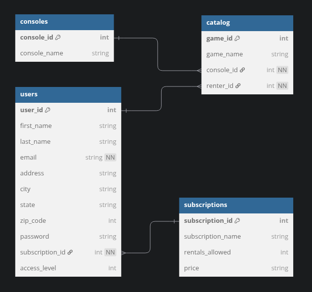

# 
<u>pyGameFlix project for IST 412</u>

## Structure

- Site describing [Flask using MVC architecture](https://plainenglish.io/blog/flask-crud-application-using-mvc-architecture)
- Example Code repo of [Flask using MVC architecture](https://github.com/sheetalkumar105/flaskmvc)

- APP_ROOT: 
    - contains application start up scripts (main.py)
    - application dependency records (Pipfile, Pipfile.lock, requirements.txt)
    - database and application structure files (GameFlix.{dbml, png, puml})
    - initial seed data (seed_data.py)
- APP_ROOT/controllers: contains scripts for each section with their functions that are called by the routes 
- APP_ROOT/migrations: scripts used to manage the database
- APP_ROOT/models: script(s) used by migrations that provide the database structure
- APP_ROOT/routes: contains blueprints and routes for the application.
- APP_ROOT/static: static files used by html templates (css, js, and images)
- APP_ROOT/templates: application html templates

## Database

